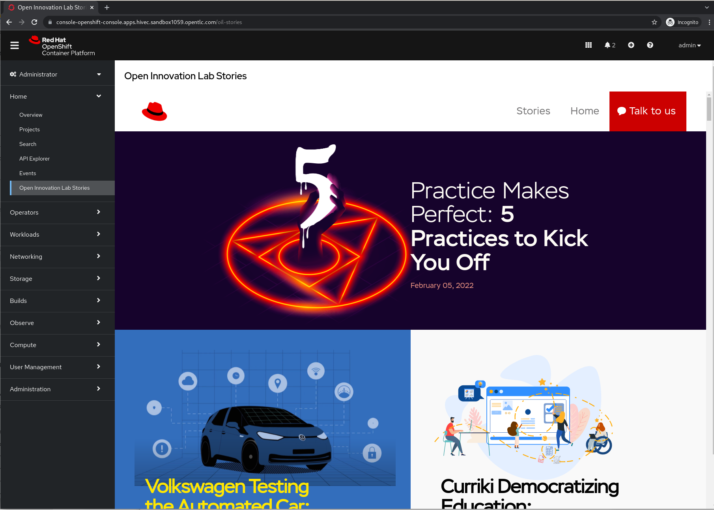

# Open Innovation Labs Stories Web Console Plugin

On a 4.10+ OpenShift cluster, deploy this dynamic console plugin:

```bash
oc process -f template.yaml \
  -p PLUGIN_NAME=oil-stories-plugin \
  -p NAMESPACE=oil-stories-plugin \
  -p IMAGE=quay.io/eformat/oil-stories-plugin:latest \
  | oc create -f -
```

```bash
oc patch consoles.operator.openshift.io cluster \
  --patch '{ "spec": { "plugins": ["oil-stories-plugin"] } }' --type=merge
```



You can build it locally using:

```bash
yarn install
podman build -t quay.io/eformat/oil-stories-plugin:latest .
podman push quay.io/eformat/oil-stories-plugin:latest .
```

The upstream [template docs](https://github.com/spadgett/console-plugin-template) follow ...

## OpenShift Console Plugin Template

This project is a minimal template for writing a new OpenShift Console dynamic
plugin. It requires OpenShift 4.10.

[Dynamic plugins](https://github.com/openshift/console/tree/master/frontend/packages/console-dynamic-plugin-sdk)
allow you to extend the
[OpenShift UI](https://github.com/openshift/console)
at runtime, adding custom pages and other extensions. They are based on
[webpack module federation](https://webpack.js.org/concepts/module-federation/).
Plugins are registered with console using the `ConsolePlugin` custom resource
and enabled in the console operator config by a cluster administrator.

[Node.js](https://nodejs.org/en/) and [yarn](https://yarnpkg.com) are required
to build and run the example.

## Getting started

After cloning this repo, you should update the plugin metadata such as the
plugin name in the `consolePlugin` declaration of [package.json](package.json).

```json
"consolePlugin": {
  "name": "my-plugin",
  "version": "0.0.1",
  "displayName": "My Plugin",
  "description": "Enjoy this shiny, new console plugin!",
  "exposedModules": {
    "ExamplePage": "./components/ExamplePage"
  },
  "dependencies": {
    "@console/pluginAPI": "*"
  }
}
```

The template adds a single example page in the Home navigation section. The
extension is declared in the [console-extensions.json](console-extensions.json)
file and the React component is declared in
[src/components/ExamplePage.tsx](src/components/ExamplePage.tsx).

You can run the plugin using a local development environment or build an image
to deploy it to a cluster.

## Development

### Option 1: Local

1. `yarn install`
2. `yarn run start`

The server runs on port 9001 with CORS enabled.

See the plugin development section in
[Console Dynamic Plugins README](https://github.com/openshift/console/tree/master/frontend/packages/console-dynamic-plugin-sdk/README.md)
for details on how to run OpenShift console using local plugins.

When a local console server is running, visit <http://localhost:9000/example>
to see the example plugin page.

### Option 2: Docker + VSCode Remote Container

Make sure the
[Remote Containers](https://marketplace.visualstudio.com/items?itemName=ms-vscode-remote.remote-containers)
extension is installed. This method uses Docker Compose where one container is
the OpenShift console and the second container is the plugin. It requires that
you have access to an existing OpenShift cluster. After the initial build, the
cached containers will help you start developing in seconds.

1. Create a `dev.env` file inside the `.devcontainer` folder with the correct values for your cluster:

```bash
OC_PLUGIN_NAME=my-plugin
OC_URL=https://api.example.com:6443
OC_USER=kubeadmin
OC_PASS=<password>
```

2. `(Ctrl+Shift+P) => Remote Containers: Open Folder in Container...`
3. `yarn run start`
4. Navigate to <http://localhost:9000/example>

## Docker image

Before you can deploy your plugin on a cluster, you must build an image and
push it to an image registry.

1. Build the image:
   ```sh
   docker build -t quay.io/my-repositroy/my-plugin:latest .
   ```
2. Run the image:
   ```sh
   docker run -it --rm -d -p 9001:80 quay.io/my-repository/my-plugin:latest
   ```
3. Push the image:
   ```sh
   docker push quay.io/my-repository/my-plugin:latest
   ```

## Deployment on cluster

After pushing an image with your changes to a registry, you can deploy the
plugin to a cluster by instantiating the provided
[OpenShift template](template.yaml). It will run a light-weight nginx HTTP
server to serve your plugin's assets.

```sh
oc process -f template.yaml \
  -p PLUGIN_NAME=my-plugin \
  -p NAMESPACE=my-plugin-namespace \
  -p IMAGE=quay.io/my-repository/my-plugin:latest \
  | oc create -f -
```

`PLUGIN_NAME` must match the plugin name you used in the `consolePlugin`
declaration of [package.json](package.json).

Once deployed, patch the
[Console operator](https://github.com/openshift/console-operator)
config to enable the plugin.

```sh
oc patch consoles.operator.openshift.io cluster \
  --patch '{ "spec": { "plugins": ["my-plugin"] } }' --type=merge
```

## References

- [Console Plugin SDK README](https://github.com/openshift/console/tree/master/frontend/packages/console-dynamic-plugin-sdk)
- [Customization Plugin Example](https://github.com/spadgett/console-customization-plugin)
- [Dynamic Plugin Enhancement Proposal](https://github.com/openshift/enhancements/blob/master/enhancements/console/dynamic-plugins.md)
